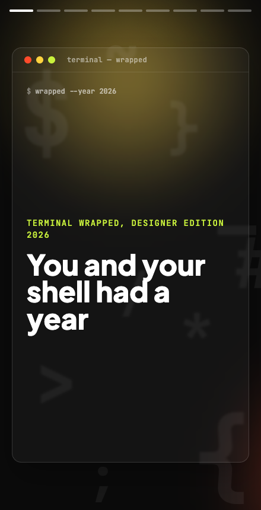
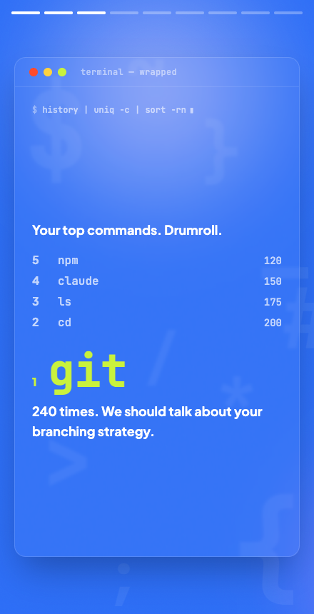
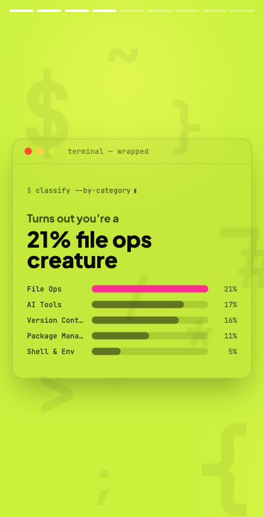
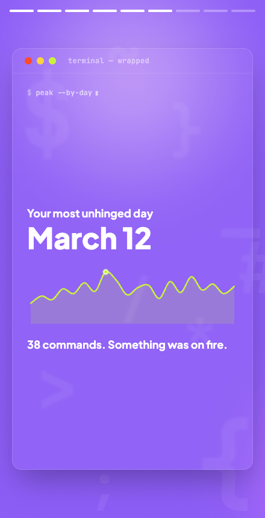

# Terminal Wrapped — Designer Edition

Spotify Wrapped, but for your terminal. Point it at your shell history and it plays your year back as a full-screen, tap-through story — your command volume, your top commands, your busiest day, the flag you reach for, and the secrets you (oops) typed in plaintext.

This is a designer edition of [`thegoldenmule/terminal-wrapped`](https://github.com/thegoldenmule/terminal-wrapped). The original built the engine — history parsing, analytics, and a React UI. This edition keeps that engine and rebuilds the experience on top of it: a narrative story instead of a dashboard, a rotating Spotify-Wrapped palette, every screen framed like a terminal window, the real data drawn as charts, and a dry, deadpan voice written for people who design *and* code.

<p align="center">
  
  
</p>
<p align="center">
  
  
</p>

## Quick Start

```bash
git clone https://github.com/saraeldebissy/terminal-wrapped-designer
cd terminal-wrapped-designer

pnpm install
pnpm build

# Run it (defaults to ~/.zsh_history)
pnpm cli:zsh
```

Your browser opens to the story. Tap or use the arrow keys to move through it; the last slide is a shareable receipt card you can download as an image.

> **Tip:** the richest result needs timestamps in your history. For zsh, add `setopt EXTENDED_HISTORY` to your `~/.zshrc` — without it, the day-by-day and date-range slides have nothing to show and are skipped.

## Other Shells

```bash
# Bash
pnpm cli -- ~/.bash_history

# Fish
pnpm cli -- ~/.local/share/fish/fish_history

# Any history file
pnpm cli -- /path/to/history
```

## Options

```bash
# Export stats as JSON instead of launching the UI
pnpm cli:zsh --json stats.json

# Filter by year
pnpm cli:zsh --year 2026

# Serve on a specific port without auto-opening the browser
pnpm cli -- ~/.zsh_history --port 4321 --no-open

# Verbose output
pnpm cli:zsh --verbose

# See all options
pnpm cli:help
```

## The Story

Slides appear only when there's data for them, so the story never has gaps:

1. **Cover** — you & your shell had a year
2. **Volume** — total commands run, and how many distinct tools
3. **Top Commands** — the countdown to your #1
4. **Type** — your command-category breakdown ("21% file-ops creature")
5. **Peak Hour** — when your terminal runs hottest, as a 24-hour histogram
6. **Busiest Day** — your most unhinged day, as a sparkline
7. **Secrets** — credentials found sitting in plaintext (with appropriate shaming)
8. **Flag** — your most-reached-for flag, shown in context (`ls -la`) with a plain-English translation
9. **Receipt** — a downloadable summary card

## What It Detects

- **Top Commands** — your most-used commands, ranked
- **Favorite Flags** — the options you reach for most (`-la`, `-m`, `-p`, …)
- **Activity Patterns** — when you're most active, by hour and by day
- **Categories** — version control, file ops, AI tools, package management, and more
- **Secrets** — GitHub tokens, API keys, and other credentials that shouldn't be in plain text

## Architecture

A pnpm monorepo:

- **`packages/cli`** — Node CLI: parses shell history (`src/history`), computes analytics (`src/analytics`), and serves the built web app over Express. `--json` writes raw stats instead.
- **`packages/web`** — React + Vite + Tailwind + Framer Motion SPA. A data-agnostic `<Story>` engine renders a manifest of slides built from the stats. Built assets are copied into the CLI for distribution.

The CLI's `Stats` type is the contract between the two. The web defends against partial data, so a thin history still produces a valid (shorter) story.

## Development

```bash
# Dev server for the web UI (reads packages/web/public/stats.json)
pnpm dev:web

# Run the test suite (Vitest)
pnpm --filter terminal-wrapped-web test

# Build individually
pnpm build:web
pnpm build:cli
```

## Credit

Forked and redesigned from [`thegoldenmule/terminal-wrapped`](https://github.com/thegoldenmule/terminal-wrapped). All the original analytics work is theirs; this edition is a visual and editorial reimagining.

## License

[GNU AGPL-3.0](./LICENSE), inherited from the original project. This is a copyleft license: any modified version — including one run as a hosted web service — must make its source available to users under the same terms.
